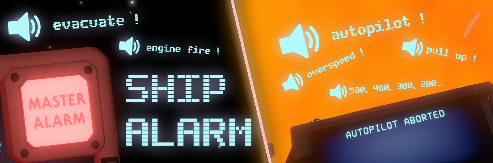

# Ship Alarm
This mod adds **20 new audio cues** to your ship, in the form of **5 useful alarms** to make you a more cautious pilot. 

- Select between different real life airplanes alarms. Current choices are : **Boeing** and **McDonnel Douglas**
- Select what the ship should read for you. Current choices are : **Altitude** (distance between the selected target and the ship) and **Speed** (speed at which the ship approach the selected target)
- Be warned when you are closing in too fast to your target or when you fly too close to the sun with **Overspeed** and **Altitude Warning**
- Know quickly if the damages you've sustain are dangerous or not with the **Evacuation** alarm
- Listen to the **Stall Warning** to know if you are starting to fall and should pitch up.
